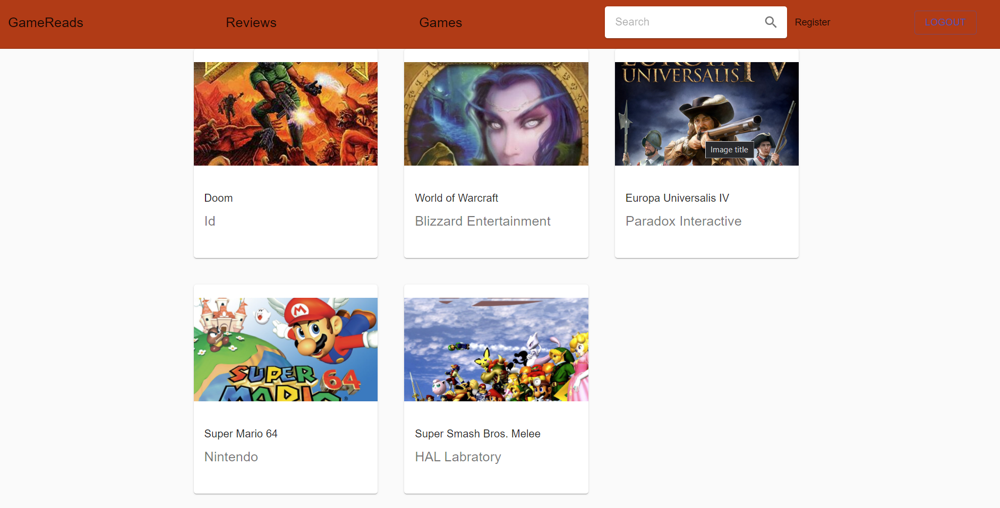
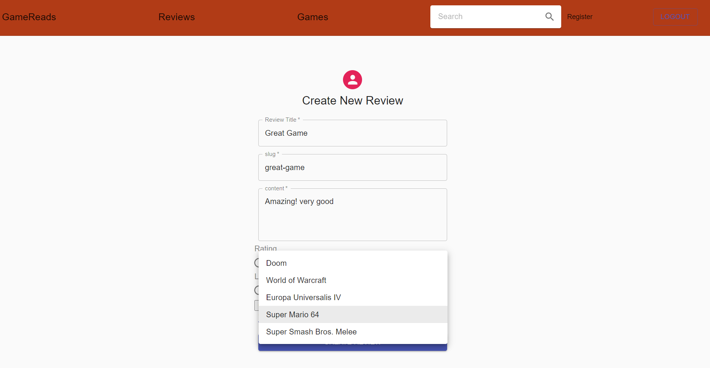
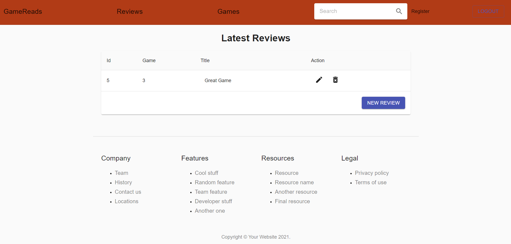
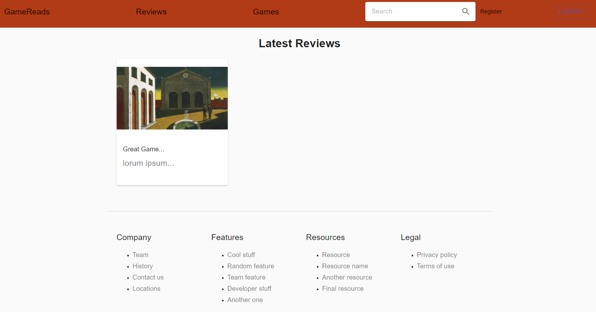

# DjangoGameBackend
*Heroku Apps hosted for free last a maximum of 30 minutes after the creater runs them. Thus I cannot guarantee the project will be viewable at all times. Please take a look at some of the following screenshots as a demonstration of the project.* 
https://sleepy-eyrie-75689.herokuapp.com/

*Also, Images are served locally. As per Heroku Support, "We do not recommend trying to add nginx to your stack, nor does Heroku provide that layer."* 

Several Game objects exist on the backend. Data associated with each game includes: the title name, the studio as well as aggregated ratings from multiple reviews.

Users select the game they wish to review and assign a number from 1 - 5 for their opinion on the game's rating and legacy. Game Ratings are updated with each review published.

Users have the ability to edit/delete their posted reviews.

Users can see the other reviews of all community members. As well as a side-note, users are authenticated and assigned access and refresh tokens.

